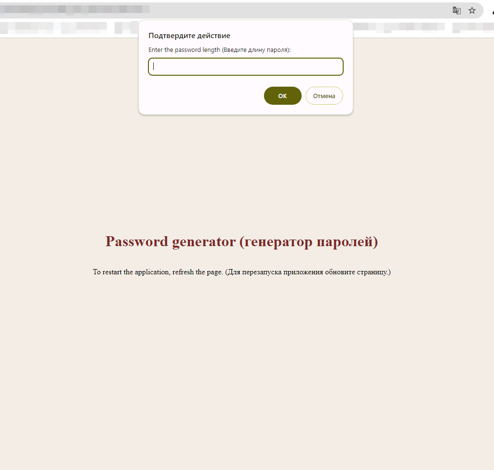
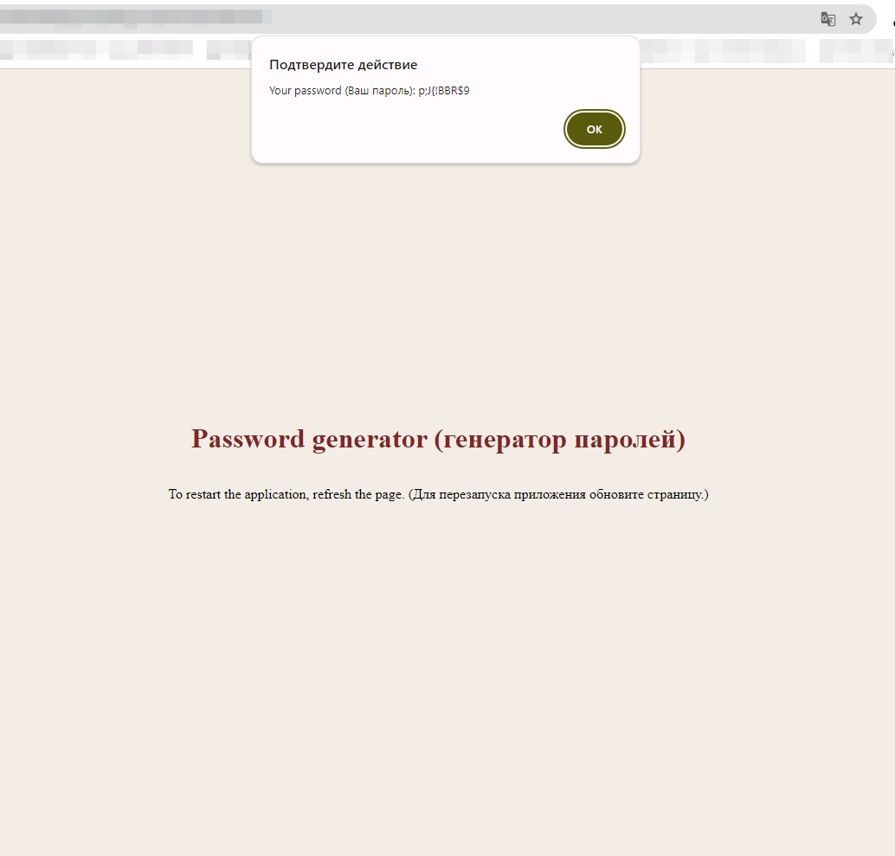

# Password Generator App (Приложение генерации паролей)

## Description(RU) (Описание)
Скрипт предлагает пользователю ввести необходимую длину пароля, после чего гененрируется набор случайных знаков для пароля и выводится на экран.
Попробовать сгененрировать свой собственный пароль можно перейдя по ссылке https://ivan-ust402.github.io/MP-gen-password/.

## Description(En)
The script prompts the user to enter the required password length, after which a set of random characters for the password is generated and displayed on the screen.
You can try to generate your own password by following the link https://ivan-ust402.github.io/MP-gen-password/.

## Technologies used
* JavaScript
* CSS
* HTML

## Visual display of the application's operation

**Picture 1.** App start screen.

**Picture 2.** App result screen.
